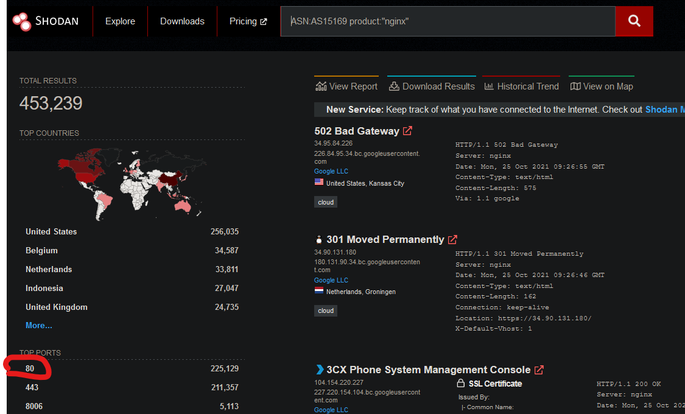

|name     | difficulty |
|---------|------------|
|Shodan.io|  easy      |

# Task 1 Introduction 

What is an Autonomous System Number (ASN) 

>Autonomous System Number (ASN) is a globally unique identifier that defines a group of one or more IP prefixes run by one or more network operators that maintain a single, 
>clearly-defined routing policy. These groups of IP prefixes are known as autonomous systems. The ASN allows the autonomous systems to exchange routing information with other autonomous systems.
>Network operators across the world need Autonomous System Numbers to control routing within their networks as well as exchange routing information with other network operators
>- example; Internet Service providers.

# Task 2 Filters 

the vul options and other is restricted to verified acount and not only (so no pay fort that)

> How do we find Eternal Blue exploits on Shodan? ||  vuln:ms17-010

# Task 3 Google & Filtering 
NOTE: the current awnser is not the one in the room the awnser change trought time 
>resources : https://thedarksource.com/shodan-cheat-sheet/
##### What is the top operating system for MYSQL servers in Google's ASN?    

>in this picture there are 2 filter ASN and product 

